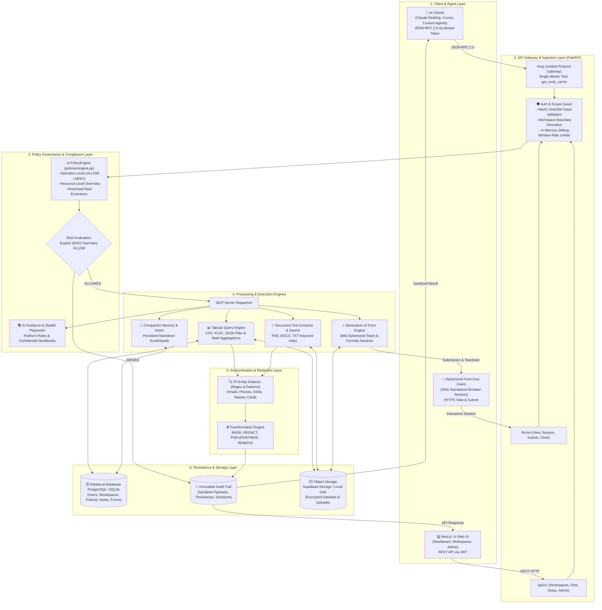
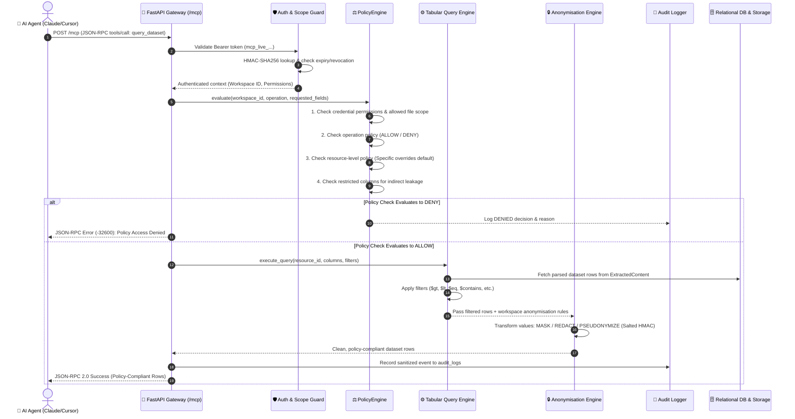
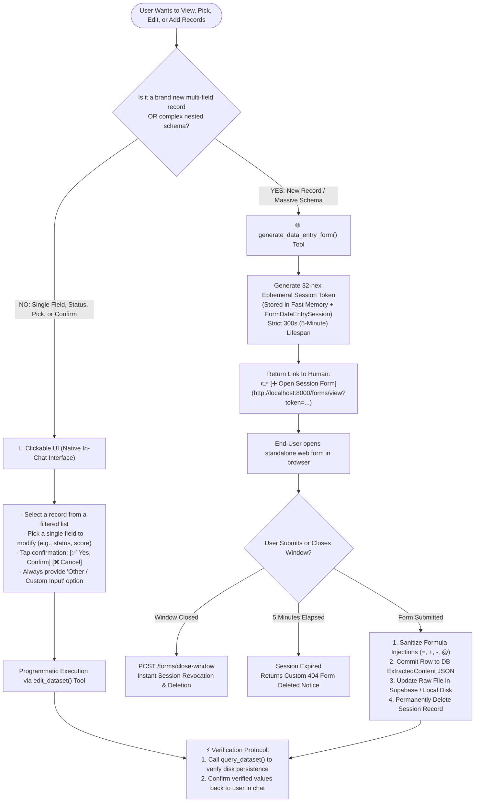
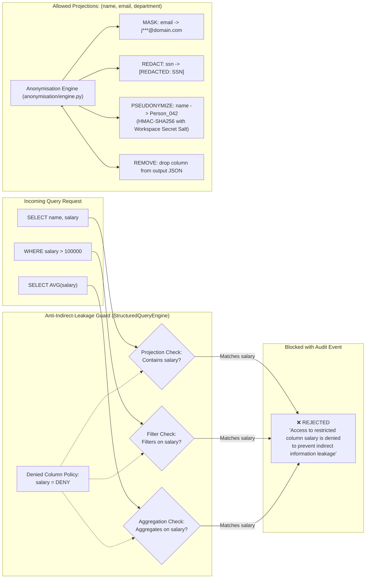
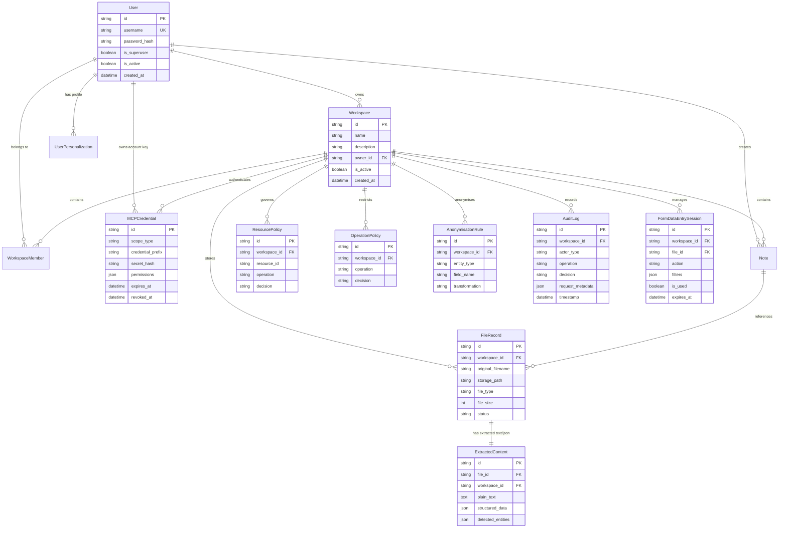

# DBMCP / POAIS: System Architecture & Workflow Charts

This document provides visual flowcharts and diagrams of the DBMCP / POAIS platform.

> [!TIP]
> You can also open the interactive HTML visualization file in your browser:  
> 👉 **[architecture_chart.html](file:///c:/Users/MUHAMMAD%20AHMAD/Downloads/DBMCP/architecture_chart.html)**

---

## 1. Complete System Architecture (6 Layers)

---

## 2. AI Agent MCP Request Execution Lifecycle

---

## 3. User Interaction Protocol: Clickable UI vs. Ephemeral Form

---

## 4. Anti-Indirect-Leakage & Anonymisation Engine

---

## 5. Relational Database Schema & Entities

